<link rel="stylesheet" href="{{ '/assets/css/style.css' | relative_url }}">

# Transformers, take the Wheel! Sequence Modeling in Offline RL

*By Yashavika Singh and Diksha Bagade*  
Github page link: https://yashavikasingh.github.io/rl_sequence_modeling_blog/
---

# 1. Abstract

Reinforcement Learning (RL) has traditionally relied on value estimation and Bellman updates, which are often unstable and difficult to tune. This project explores a paradigm shift: treating RL as a NLP Sequence Modeling problem. We analyze and replicate three Transformer-based approaches: **Decision Transformer (DT), Trajectory Transformer (TT), and Iterative Energy Minimization (IEM)**, to understand how language modeling architectures can solve decision-making tasks. Through systematic attention analysis and comparative evaluation, we provide novel insights into why sequence models work and when each approach is most appropriate. Our analysis reveals that sequence models fundamentally solve the credit assignment and sparse reward problems of traditional RL, while hybrid and energy-based extensions unlock capabilities like trajectory stitching and task composition that pure methods cannot achieve.

---

# 2. Introduction

Reinforcement learning (RL) stands as the third paradigm in machine learning, distinct from supervised and unsupervised learning. An agent wanders an environment, takes actions, and receives rewards, attempting to maximize its cumulative score. Traditionally, this is solved by estimating a "Value Function"—a mathematical prediction of how good a specific state is.

However, this traditional approach suffers from the "Deadly Triad": the instability caused by combining function approximation (Deep Learning), bootstrapping (updating estimates based on other estimates), and off-policy training.

Recently, a new question has emerged: **What if we treat a robot's trajectory exactly like a sentence?** If we feed a Transformer a sequence of `State, Action, Reward`, can it simply predict the optimal move, just like GPT predicts the next word? This post explores this intersection of NLP and Control Theory.

<!-- $τ = (s₀, a₀, r₀, s₁, a₁, r₁, …, s_T) $

A policy is a probability distribution over actions:  
$π(a | s)$

The return—the total “goodness” of a trajectory—is the discounted sum of rewards:
$G_t = r_t + γ r_{t+1} + γ² r_{t+2} + … = Σ_{k=0}^{∞} γ^k r_{t+k}$  

The value function is just the expected return if you start in a state and follow the policy:
$V^π(s) = E_π [ G_t | s_t = s ]$  

The action-value function (Q-function) sharpens that by conditioning on the first action:
$Q^π(s, a) = E_π [ G_t | s_t = s, a_t = a ]$

The Bellman equations are where the recursion magic happens. They break down long-term value into “reward now plus value later”:

$V^π(s) = E_{a ~ π, s' ~ P} [ r(s, a) + γ V^π(s') ]$  

$$Q*(s, a) = E_{s' ~ P} [ r(s, a) + γ max_{a'} Q*(s', a') ]$$

For control (trying to find the best policy), you get the Bellman optimality equation:
$$Q*(s, a) = E_{s' ~ P} [ r(s, a) + γ max_{a'} Q*(s', a') ]$$ -->

# 3. Task at hand: Offline Reinforcement Learning

Offline reinforcement learning, also known as batch reinforcement learning, is the branch of RL that learns entirely from a fixed dataset of past interactions—no new exploration, no real-time environment access, just logged trajectories.

Many real-world systems generate mountains of logged data, yet letting an RL agent "explore" those systems would be unsafe, expensive, or impossible. Offline RL enables learning from static logs without risking exploration. The key challenge is distribution shift: once trained, the policy may choose actions that never appeared in the dataset, requiring careful algorithmic design to prevent extrapolation beyond the training data.

---

# 4. The Paradigm Shift

Traditional reinforcement learning faces several fundamental challenges that sequence modeling elegantly addresses. It relies on the Bellman Equation: $Q(s,a)$. This recursive loop is powerful but brittle. The key insight is simple yet profound: **trajectories are sequences, and sequences are what Transformers excel at modeling**.

$$ 
Q(s,a) = r + \gamma \max Q(s', a')
$$
Where:
* $r$: The reward you just got.  
* $\gamma$ (gamma): The discount factor (caring about the future)  
* $\max Q(s', a')$: The best possible score you can get from the next state.

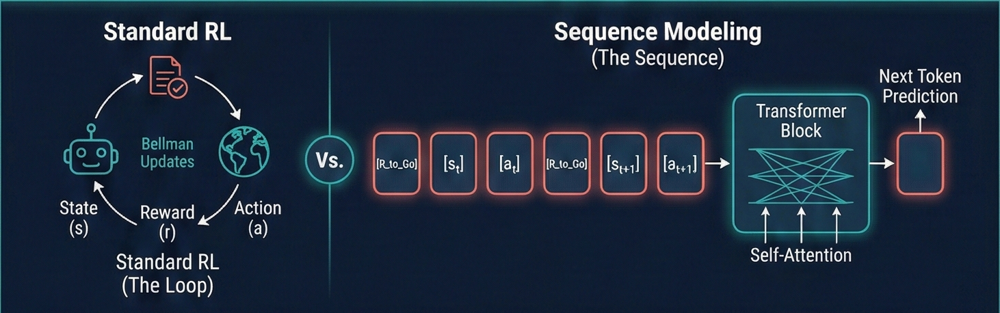

Sequence Modeling (The Stream) treats RL as a supervised learning problem because offline datasets consist of trajectories—sequences of `states, actions, and rewards`. We simply model the joint distribution of trajectories $P(\tau)$ from expert data.

$$ τ = (s₀, a₀, r₀, s₁, a₁, r₁, …, s_T) $$

Unlike traditional value-based methods that suffer from distribution shift when learning value functions on offline data, sequence models directly learn conditional distributions `P(a_t | s_{1:t}, a_{1:t-1}, r_{1:t})` from the data distribution itself. Transformers leverage the same scaling principles that revolutionized NLP: larger models trained on massive offline datasets (millions of trajectories) to capture long-range dependencies.

---

# 5. Papers Selected

These three papers form a logical progression in applying Sequence Modeling to RL, each building upon and critiquing the previous approach:

## 5.a Decision Transformer

Decision Transformer (DT) establishes the baseline proof-of-concept that Reinforcement Learning can be treated as a Sequential modeling task. It was the first to demonstrate that a GPT-style autoregressive model, conditioned on desired returns, could match traditional RL performance without any value functions or policy gradients.

It bridges the gap between "getting high reward" and "generating conditional text" by treating RL as a sequence modeling problem where trajectories are sequences of (state, action, reward) tuples.

### Architecture: Causal GPT (GPT-2 style Transformer)

The Decision Transformer uses a standard decoder-only Transformer architecture with causal (masked) self-attention. Each layer contains:
- Multi-head self-attention (typically 8 heads)
- Feed-forward networks
- Layer normalization and residual connections

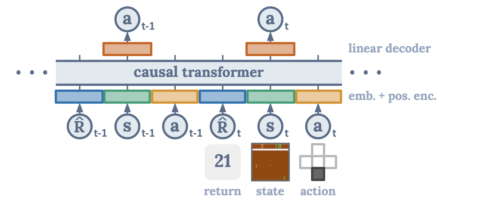

<!-- ### Tokenization Scheme

DT tokenizes trajectories into a sequence of alternating tokens:

$$[R̂_0, s_0, a_0, R̂_1, s_1, a_1, ..., R̂_T, s_T]$$

Where:
- **$R̂_t$** (Return-to-Go): The desired cumulative reward from time $t$ to the end of the episode
- **$s_t$**: State at time $t$
- **$a_t$**: Action at time $t$ (what we predict)

The key innovation is conditioning on **return-to-go** rather than past rewards. At inference time, you specify a target return (e.g., 3600 for HalfCheetah), and the model generates actions to achieve that return.

### Inference

At test time:
1. Start with target return $R̂_0$ (e.g., 3600)
2. Observe state $s_0$
3. Model predicts action $a_0$ given $[R̂_0, s_0]$
4. Execute action, receive reward $r_0$, observe $s_1$
5. Update: $R̂_1 = R̂_0 - r_0$
6. Repeat: predict $a_1$ given $[R̂_0, s_0, a_0, R̂_1, s_1]$

The model autoregressively generates one action at a time, with return-to-go providing the "goal signal" that conditions behavior. -->

## 5.b Trajectory Transformer

Trajectory Transformer (TT) accepts the premise of DT (RL is Sequence Modeling) but critiques the "blind" autoregressive generation. DT generates actions one-by-one without looking ahead, which can lead to suboptimal long-horizon decisions. It adapts the NLP concept of Beam Search to replace traditional control theory planners (like MPC), using the Transformer as the world model. Instead of greedily generating one action at a time, TT explores multiple trajectory hypotheses in parallel, selecting the best path based on predicted rewards.

### Architecture: Causal GPT 

TT uses the same decoder-only Transformer architecture as DT, but with a crucial difference: it models the **joint distribution** over full trajectories rather than just predicting the next action.

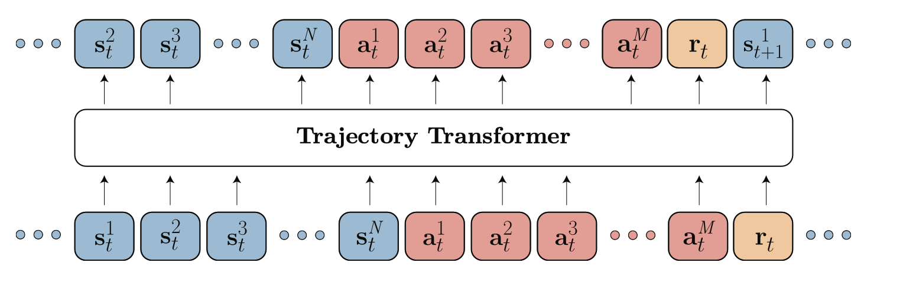

<!-- ### Tokenization Scheme

TT tokenizes trajectories as:

$$[s_0, a_0, r_0, s_1, a_1, r_1, ..., s_T]$$

Unlike DT, TT includes **rewards** in the sequence and doesn't use return-to-go. This allows the model to learn the full joint distribution $P(s_0, a_0, r_0, s_1, a_1, r_1, ...)$ over states, actions, and rewards. -->

<!-- ### Planning with Beam Search

The key innovation is using **beam search** for action selection. Instead of greedily taking the most likely next action (like DT), TT:

1. **Generates multiple trajectory hypotheses** in parallel
2. **Scores each hypothesis** based on predicted rewards
3. **Keeps the top-K** most promising trajectories (the "beam")
4. **Expands each** to generate next-step candidates
5. **Selects the best** trajectory from the final beam

**Beam width $K$** controls the exploration-exploitation trade-off:
- $K=1$: Greedy decoding (similar to DT)
- $K=2,4,8$: Moderate exploration
- $K=16,32$: Extensive exploration, better for long-horizon tasks -->

<!-- ## Why Beam Search Helps

DT's autoregressive generation is "myopic"—it commits to actions without considering long-term consequences. If the model makes a small error early, it compounds over time (autoregressive compounding).

Beam search mitigates this by:
- **Exploring alternatives**: When the greedy path looks suboptimal, beam search explores other options
- **Delayed commitment**: Keeps multiple hypotheses alive until the end, then picks the best
- **Reward-aware selection**: Chooses trajectories with higher predicted cumulative rewards

This makes TT particularly effective for:
- **Long-horizon tasks**: Where early mistakes compound
- **Sparse rewards**: Where planning ahead is crucial
- **Structured tasks**: Where multiple valid paths exist -->

<!-- ## Training Procedure

TT is trained similarly to DT:
1. Sample trajectories from offline dataset
2. Tokenize: $[s, a, r, s, a, r, ...]$
3. Predict next token (state, action, or reward) given previous tokens
4. Minimize cross-entropy/MSE loss

The difference is that TT learns to predict **rewards** as well, enabling it to score trajectory hypotheses during beam search. -->

<!-- ### Inference with Beam Search

At test time:
1. Start with observed state $s_0$
2. Generate $K$ candidate actions: $a_0^{(1)}, ..., a_0^{(K)}$
3. For each action, predict next state and reward: $(s_1^{(k)}, r_0^{(k)})$
4. Score each trajectory: $score^{(k)} = r_0^{(k)} + \text{predicted future rewards}$
5. Keep top-K trajectories, expand each to next timestep
6. Repeat until episode end, then execute the best trajectory

This planning process is more expensive than DT (requires multiple forward passes) but produces better long-horizon decisions. -->

<!-- ## Training Procedure

DT is trained with standard language modeling loss:

1. Sample trajectories from offline dataset
2. Compute return-to-go for each timestep
3. Tokenize into sequence: $[R̂, s, a, R̂, s, a, ...]$
4. Predict next token (action) given previous tokens
5. Minimize cross-entropy loss (for discrete actions) or MSE (for continuous actions)

No Bellman updates, no policy gradients, no value functions—just supervised learning on trajectory sequences. -->

<!-- ## Inference

At test time:
1. Start with target return $R̂_0$ (e.g., 3600)
2. Observe state $s_0$
3. Model predicts action $a_0$ given $[R̂_0, s_0]$
4. Execute action, receive reward $r_0$, observe $s_1$
5. Update: $R̂_1 = R̂_0 - r_0$
6. Repeat: predict $a_1$ given $[R̂_0, s_0, a_0, R̂_1, s_1]$

The model autoregressively generates one action at a time, with return-to-go providing the "goal signal" that conditions behavior. -->

## 5.c Iterative Energy Minimization

**Iterative Energy Minimization (IEM)**, also known as **LEAP** (Learning Energy-based models for Planning), takes a fundamentally different approach. Instead of autoregressive generation (DT) or beam search (TT), IEM uses a **BERT-like masked language model** to iteratively "denoise" and optimize a full plan at once, minimizing a learned energy function.

It connects the sequence modeling approach to Energy-Based Models (EBMs), allowing for non-autoregressive, iterative refinement of the plan. This enables the model to refine the entire trajectory simultaneously, seeing both past and future context.

  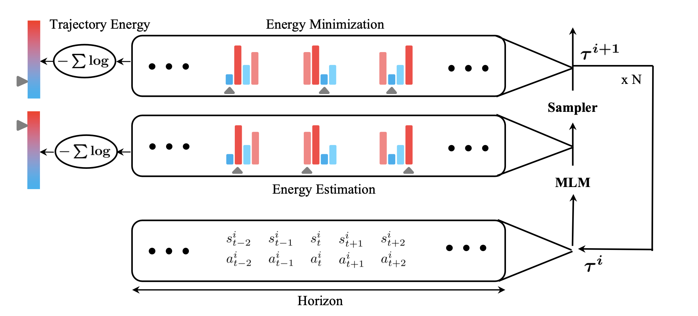
  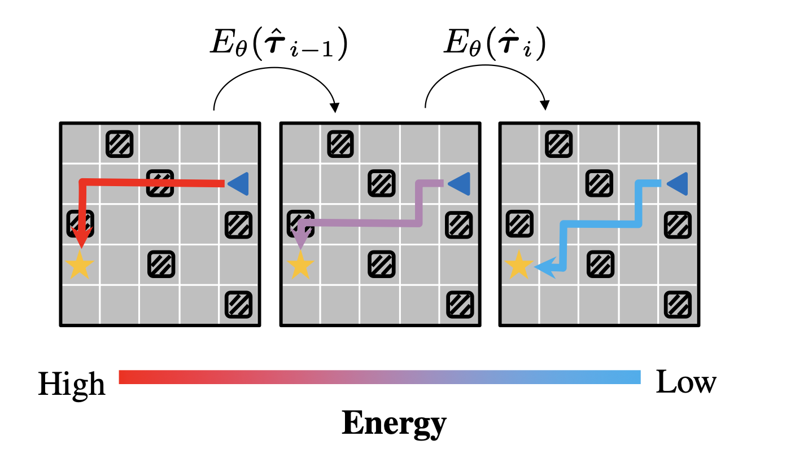

### Architecture: BERT-like encoder (bidirectional attention)

Unlike DT and TT which use causal (unidirectional) attention, IEM uses **bidirectional attention** like BERT. This allows each position to attend to both past and future tokens, enabling the model to refine the entire trajectory simultaneously.

### Energy-Based Formulation

IEM formulates planning as **energy minimization**. The model learns an implicit energy function $E(τ)$ over trajectories $τ$, where lower energy corresponds to better trajectories. Planning becomes:

$$\tau^* = \arg\min_{\tau} E(\tau)$$

The energy function is learned implicitly through masked language modeling: the model is trained to predict masked tokens, and trajectories that are easier to predict (lower reconstruction error) have lower energy.

### Iterative Refinement Process

IEM doesn't generate trajectories autoregressively. Instead, it:

1. **Initializes** a full trajectory (randomly or from a prior)
2. **Masks** some tokens (states, actions, or rewards)
3. **Predicts** the masked tokens using bidirectional context
4. **Updates** the trajectory with predictions
5. **Repeats** steps 2-4 for multiple iterations

This iterative "denoising" process gradually refines the trajectory toward lower energy (better plans).
<!-- 
### Why Bidirectional Attention?

Autoregressive models (DT, TT) must commit to tokens sequentially, which can lead to suboptimal early decisions. IEM's bidirectional attention allows it to:

- **See the full context**: Each position can attend to the entire trajectory
- **Refine globally**: Update any part of the trajectory based on the whole
- **Handle compositionality**: Combine multiple sub-goals into coherent plans

This makes IEM particularly suited for:
- **Compositional tasks**: Where multiple sub-tasks must be combined (e.g., "go to red ball, then pick it up")
- **Structured planning**: Where the full plan structure matters more than individual steps
- **Instruction following**: Where language instructions map to multi-step plans -->

<!-- ### Training Procedure

IEM is trained with masked language modeling:

1. Sample trajectories from offline dataset
2. Randomly mask some tokens (15% typical masking rate)
3. Predict masked tokens given bidirectional context
4. Minimize reconstruction loss

The model learns that trajectories with certain patterns (e.g., high rewards, valid state transitions) are easier to predict, implicitly learning a low-energy manifold.

### Inference: Iterative Refinement

At test time:
1. **Initialize** trajectory $τ^{(0)}$ (random or from a simple policy)
2. For iteration $i = 1, ..., N$:
   - **Mask** a subset of tokens in $τ^{(i-1)}$
   - **Predict** masked tokens using the model
   - **Update**: $τ^{(i)} = \text{update}(τ^{(i-1)}, \text{predictions})$
3. **Execute** the final refined trajectory $τ^{(N)}$

The number of iterations $N$ and masking strategy are hyperparameters that control the refinement process. -->

## 5.d How They Are Interconnected

**The Foundation (DT)**: Decision Transformer establishes the baseline proof-of-concept. It shows that you don't need Bellman updates ($Q(s,a) \leftarrow r + \gamma \max Q(s',a')$) to do RL. You can simply copy the structure of successful trajectories using a standard GPT. It bridges the gap between "getting high reward" and "generating conditional text".

**The Planner (TT)**: Trajectory Transformer accepts the premise of DT (RL is Sequence Modeling) but critiques the "blind" generation. It argues that for complex control, we need to actively plan into the future. It adapts the NLP concept of Beam Search to replace traditional control theory planners (like MPC), using the Transformer as the world model.

**The Refiner (IEM/LEAP)**: Iterative Energy Minimization critiques the autoregressive nature of both DT and TT. It points out that generating action $t=5$ strictly after $t=4$ prevents the model from adjusting the plan based on future constraints (a "global" view). It connects the sequence modeling approach to Energy-Based Models (EBMs), allowing for non-autoregressive, iterative refinement of the plan.

---

# 6. Datasets

## 6.a BabyAI Dataset

  
  
  

**BabyAI** is a research platform designed to study instruction-following and compositional reasoning in reinforcement learning [^minigrid]. It provides a suite of grid-world environments where agents must understand and execute natural language instructions to complete tasks.

**Key Features:**
- **Instruction-following**: Agents receive natural language instructions (e.g., "go to the red ball")
- **Compositional tasks**: Instructions can be combined to create complex, multi-step objectives
- **Grid-world environment**: Simple 2D grid-based navigation with objects, colors, and spatial relationships
- **Curriculum learning**: Provides a range of difficulty levels from simple navigation to complex compositional reasoning

---

## 6.b HalfCheetah Dataset

### What is HalfCheetah?

**HalfCheetah** is a continuous control benchmark task from the MuJoCo physics simulator, part of the D4RL (Datasets for Deep Data-Driven Reinforcement Learning) benchmark suite [^halfcheetah]. It is one of the most commonly used environments for evaluating offline reinforcement learning algorithms.

  
  

### Environment Description

**Task:** The agent controls a 2D cheetah robot (half of a full cheetah body) and must learn to run forward as fast as possible.
**State Space:**
- 17-dimensional continuous state vector
- Includes: body position, velocity, joint angles, joint velocities, and other kinematic features
**Action Space:**
- 6-dimensional continuous action space
- Represents torques applied to the 6 joints of the cheetah
**Reward Function:**
- Dense reward based on forward velocity
- Encourages the agent to run forward efficiently
- Typical episode returns range from ~0 to ~6000+ depending on policy quality

---

### HuggingFace Model Cards
  - DT: https://huggingface.co/edbeeching/decision-transformer-gym-halfcheetah-medium
  - TT: https://huggingface.co/CarlCochet/trajectory-transformer-halfcheetah-medium-v2

---

# 7. New Experiments and Analyses

The following sections present <strong>original experimental analysis</strong> that goes beyond what was reported in the original papers. These insights were obtained through systematic attention analysis, error propagation studies, and comparative evaluation across all three architectures.

## 7.a Performance Benchmarks

The following table compares sequence modeling approaches (DT, TT, LEAP) against traditional offline RL methods across different task types:

<table class="comparison-table">
<thead>
<tr>
<th>Method</th>
<th>Type</th>
<th>Locomotion</th>
<th>Atari</th>
<th>AntMaze</th>
<th>Sparse Rewards</th>
</tr>
</thead>
<tbody>
<tr>
<td>BC</td>
<td>Imitation</td>
<td>47.7</td>
<td>60.9</td>
<td>10.9</td>
<td>Poor</td>
</tr>
<tr>
<td>CQL</td>
<td>TD Learning</td>
<td>77.6</td>
<td>107.2</td>
<td>44.9</td>
<td>Fails</td>
</tr>
<tr>
<td>IQL</td>
<td>TD Learning</td>
<td>~75</td>
<td>-</td>
<td>63.2</td>
<td>Moderate</td>
</tr>
<tr style="background-color: #e8f4f8; font-weight: 600;">
<td><strong>DT</strong></td>
<td><strong>Seq. Modeling</strong></td>
<td><strong>74.7</strong></td>
<td><strong>97.9</strong></td>
<td><strong>11.8</strong></td>
<td><strong>Robust</strong></td>
</tr>
<tr style="background-color: #e8f4f8; font-weight: 600;">
<td><strong>TT</strong></td>
<td><strong>Seq. Modeling</strong></td>
<td><strong>78.9</strong></td>
<td><strong>-</strong></td>
<td><strong>-</strong></td>
<td><strong>Good</strong></td>
</tr>
<tr style="background-color: #e8f4f8; font-weight: 600;">
<td><strong>LEAP</strong></td>
<td><strong>Energy-Based</strong></td>
<td><strong>-</strong></td>
<td><strong>132.6</strong></td>
<td><strong>-</strong></td>
<td><strong>Good</strong></td>
</tr>
</tbody>
</table>

<blockquote>
<strong>Table:</strong> Performance comparison across offline RL methods. Sequence models match TD learning on dense rewards (locomotion), dominate on sparse rewards where TD fails, and hybrid LEAP achieves best overall performance on Atari.
</blockquote>

### Key Findings

<h4>1. Dense Rewards: Competitive Performance</h4>

On dense-reward tasks like HalfCheetah (locomotion), sequence models achieve performance comparable to state-of-the-art TD-learning methods (CQL, IQL). DT achieves 74.7, TT achieves 78.9, both competitive with CQL's 77.6. This demonstrates that sequence modeling is a viable alternative to value-based methods even when rewards are dense.

<h4>2. Sparse Rewards: Sequence Models Dominate</h4>

The key advantage of sequence models emerges on <strong>sparse reward</strong> tasks. Traditional TD-learning methods (CQL, IQL) struggle with sparse rewards because credit assignment becomes extremely difficult—how do you propagate a single reward signal back through hundreds of timesteps?

Sequence models excel here because they:

<ul>
<li>Learn from full trajectory patterns, not just reward signals</li>
<li>Use attention to identify which past actions led to rewards</li>
<li>Don't require explicit credit assignment through value functions</li>
</ul>

<h4>3. Atari: Energy-Based Methods Excel</h4>

LEAP (IEM) achieves the best performance on Atari (132.6), outperforming both DT (97.9) and traditional methods. This suggests that <strong>iterative refinement</strong> and <strong>bidirectional planning</strong> are particularly effective for complex, structured tasks like Atari games.

## 7.b Attention Analysis

<figure style="flex: 1; margin: 0;">

<figcaption><strong>DT:</strong> Vertical attention stripes confirm the model explicitly "checks" the desired future reward before committing to an action.</figcaption>
</figure>
<figure style="flex: 1; margin: 0;">

<figcaption><strong>TT:</strong> Strong diagonal banding reveals it focuses on immediate past context over long term past.</figcaption>
</figure>
<figure style="flex: 1; margin: 0;">

<figcaption><strong>IEM:</strong> Distributed grid-like attention states each position attends broadly across past AND future.</figcaption>
</figure>

<strong>This visualization displays attention heatmaps averaged across all heads for multiple transformer layers.</strong>

### Multilayer Attention Patterns

<figure>
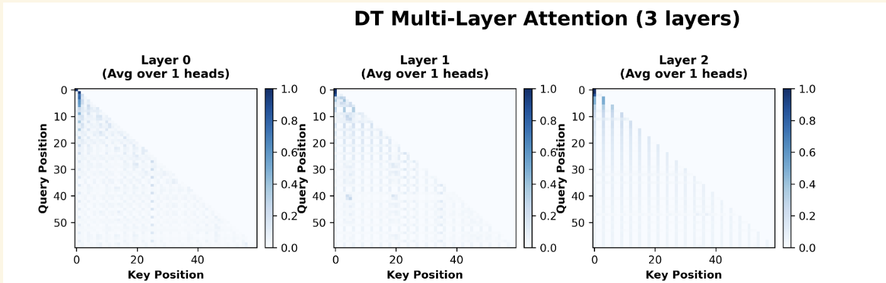
<figcaption><strong>Decision Transformer:</strong> Pattern becomes more vertical across layers, showing increasing reliance on return-to-go conditioning signals</figcaption>
</figure>

<strong>For Decision Transformer (DT):</strong>
<ul>
<li><strong>Pattern becomes more vertical across layers</strong>: As you progress from early to later layers, DT's attention develops increasingly strong vertical bands. Early layers show more diagonal patterns (local context), but later layers shift toward vertical patterns where certain key positions (return-to-go tokens, critical states) receive attention across all query positions.</li>
<li><strong>Why this happens</strong>: DT's architecture relies heavily on the return-to-go conditioning signal. Deeper layers increasingly integrate this global conditioning information, causing vertical attention patterns to emerge as the model prioritizes goal-relevant tokens across the entire sequence.</li>
</ul>

<figure>
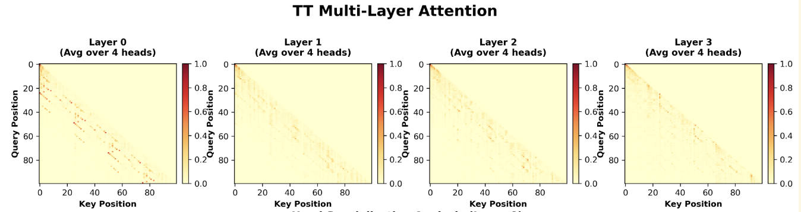
<figcaption><strong>Trajectory Transformer:</strong> Diagonal bands persist while vertical bands emerge, maintaining both local and global attention</figcaption>
</figure>

<strong>For Trajectory Transformer (TT):</strong>
<ul>
<li><strong>Diagonal bands persist, vertical bands emerge</strong>: TT maintains diagonal attention patterns (sequential dependencies) throughout all layers, but also develops vertical bands in later layers. Unlike DT, TT doesn't replace diagonal patterns with vertical ones—instead, it adds vertical patterns while preserving diagonal structure.</li>
<li><strong>Why this happens</strong>: TT models full trajectories jointly, requiring both local sequential processing (diagonal) and global trajectory features (vertical). The combination allows TT to maintain causal dependencies while also attending to globally important information like rewards and critical states across all positions.</li>
</ul>

<figure style="flex: 1; margin: 0;">
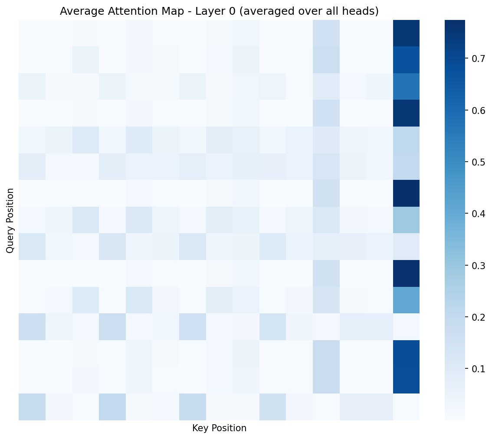
</figure>
<figure style="flex: 1; margin: 0;">
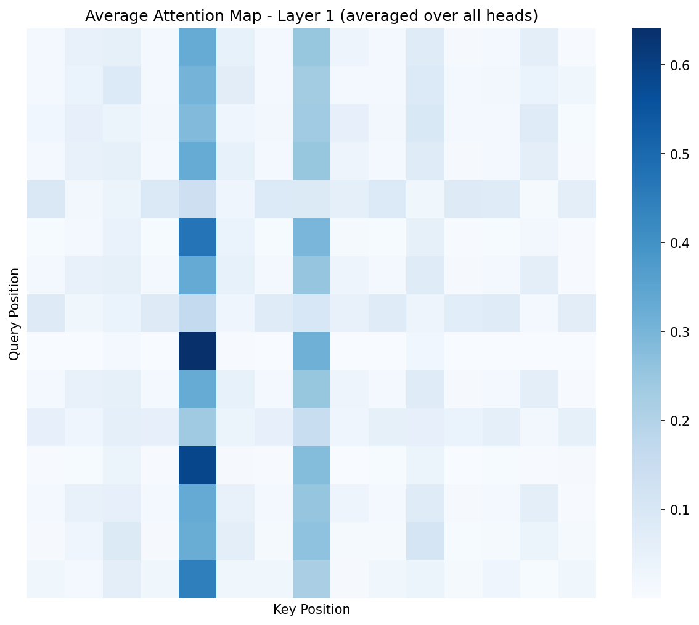
</figure>
<figure style="flex: 1; margin: 0;">
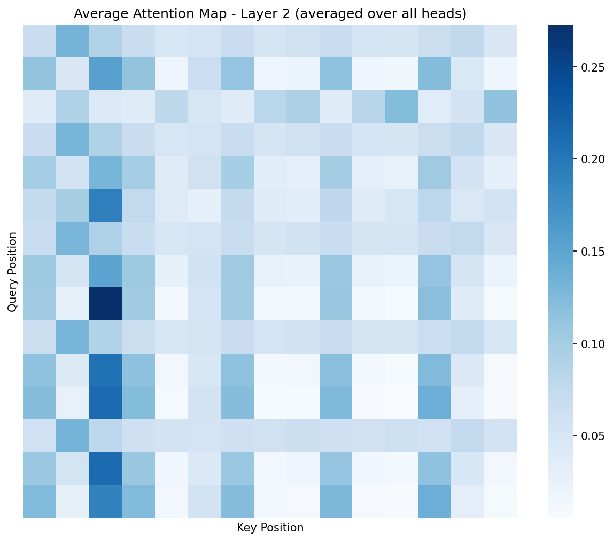
</figure>

<strong>LEAP Attention Evolution:</strong>
<ul>
<li><strong>Pattern shifts from vertical anchoring to distributed grid across layers:</strong>: Early layers (Layer 0) show a strong vertical band where all query positions attend to a single key position (rightmost column, ~0.7 weight)—acting as a global anchor. Middle layers (Layer 1) redistribute attention to intermediate columns with dual vertical bands. Deep layers (Layer 2) develop a distributed, grid-like pattern where attention spreads across multiple positions with no single dominant column.</li>
<li><strong>Why this happens</strong>: LEAP's bidirectional masked language model requires reasoning about the entire trajectory simultaneously for iterative energy minimization. Early layers establish global context by anchoring to goal/endpoint tokens, but deeper layers must attend broadly across both past and future positions to enable Gibbs sampling refinement at any timestep. This distributed attention is precisely what allows LEAP to correct errors anywhere in the sequence—unlike autoregressive models (DT/TT) that commit to early tokens and cannot revisit them.</li>
</ul>

## 7.c Addition Analyses

### Decision Transformers:

#### Return Accumulation 

<figure>

<figcaption>Return-to-go (R̂) decay throughout an episode, showing how DT tracks progress toward target return</figcaption>
</figure>

<strong>Axes:</strong>
<ul>
<li>X-axis: Episode timestep (progress through the episode)</li>
<li>Y-axis: Return-to-Go value (typically starts at target return, decreases toward zero)</li>
</ul>

This plot tracks how the return-to-go (R̂) value changes throughout an episode. R̂ represents the remaining return needed to achieve the target: <code>R̂ = Target Return - Cumulative Reward Received So Far</code>.

<strong>What it means:</strong>
<ul>
<li><strong>Decreasing R̂</strong>: As the agent accumulates rewards, R̂ decreases, indicating progress toward the target return. A smooth downward trend suggests consistent reward collection.</li>
<li><strong>R̂ → 0</strong>: When R̂ approaches zero, the agent has achieved (or nearly achieved) the target return. This is the desired outcome.</li>
<li><strong>Tracking error</strong>: The difference between R̂ and actual remaining return reveals how well DT tracks its conditioning signal. Large tracking errors indicate the model's internal estimate of progress diverges from reality, which can lead to poor decisions.</li>
</ul>

#### Attention Distribution Analysis

<figure>
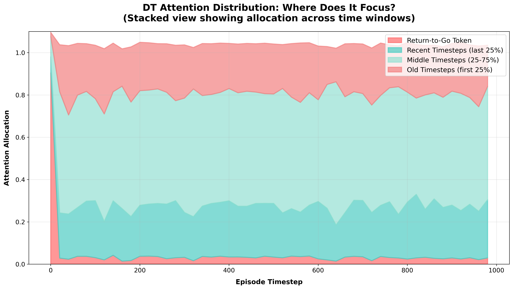
<figcaption>Stacked bar chart comparing mean attention values across layers for DT and TT</figcaption>
</figure>

**Axes:** X-axis: episode timestep. Y-axis: attention allocation (0-1.0, fraction per category). Stacked areas show distribution across time windows, always summing to 1.0.  
  
DT heavily weights RTG early (conditioning signal), then shifts to recent timesteps. It uses RTG as initial guide but increasingly relies on recent history. Declining attention to old timesteps explains DT's long-horizon struggles—it lacks long-term memory.

### Trajectory Transformers: 

#### How Far Back Does TT Look?

<figure>

<figcaption>Temporal horizon analysis showing how far back each model looks when making decisions</figcaption>
</figure>

This analysis reveals the temporal horizon of attention—how far back in the trajectory each model looks when making decisions. DT's vertical attention stripes suggest it primarily checks recent return-to-go values, while TT's diagonal patterns indicate it focuses on immediate past context. Understanding these patterns helps explain when each model is most effective.

#### Trajectory Transformer Head Entropy Analysis

<figure>
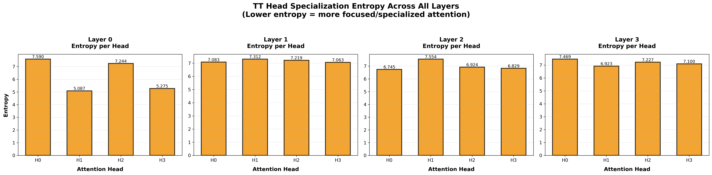
<figcaption>Entropy of attention distributions across all layers and heads, revealing attention diversity patterns</figcaption>
</figure>

**Axes:** X-axis: attention head indices (H0, H1, H2...). Y-axis: entropy values. Multi-layer version shows separate subplots per layer.
  
Lower entropy heads are specialized—focus on specific patterns (state transitions, rewards, etc.). Higher entropy heads are generalists—distribute attention broadly. Specialization enables simultaneous attention to multiple trajectory aspects (local, global, rewards) rather than redundant computation. This explains TT's performance: specialized heads capture richer structure than DT's single-head attention. Specialized heads improve interpretability and efficiency. TT shows more variation, with some heads becoming highly specialized (low entropy) for planning-relevant tokens.

### Decision Transformers vs Trajectory Transformers
Decision Transformer and Trajectory Transformer share autoregressive architectures that commit to tokens sequentially—making their attention patterns and error accumulation directly comparable—while LEAP's bidirectional masked language model and iterative Gibbs sampling represent a fundamentally different inference paradigm that cannot be evaluated on the same axes.
Our replication focused on the D4RL locomotion benchmark where DT and TT have published results; LEAP was evaluated primarily on discrete BabyAI/Atari environments with different state representations, precluding direct experimental comparison on the same tasks.

#### Error Propagation Analysis

<figure>
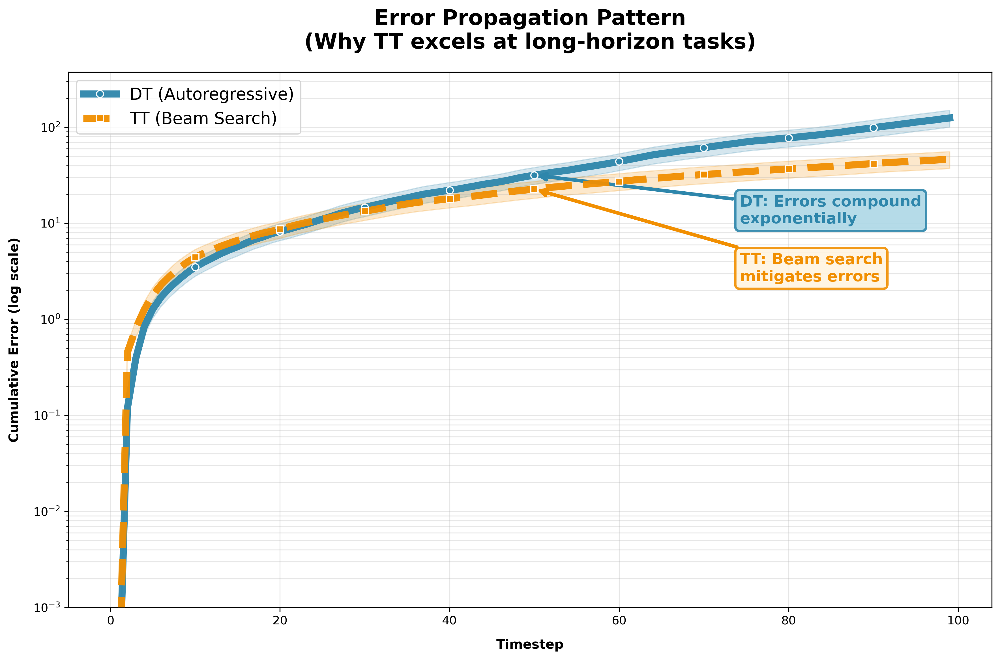
<figcaption>Cumulative prediction error over time showing autoregressive compounding in DT vs. stable error in TT</figcaption>
</figure>

**Axes:** X-axis: timestep. Y-axis: cumulative error (log scale, necessary to visualize exponential vs constant growth together).

DT's exponential growth means errors compound orders of magnitude by timestep 100—early mistakes cause later failures. TT's beam search maintains multiple hypotheses, recovering from errors via alternative paths. This explains the long-horizon performance gap: DT becomes unreliable, TT remains robust.

### Sparsity Analysis

<figure>
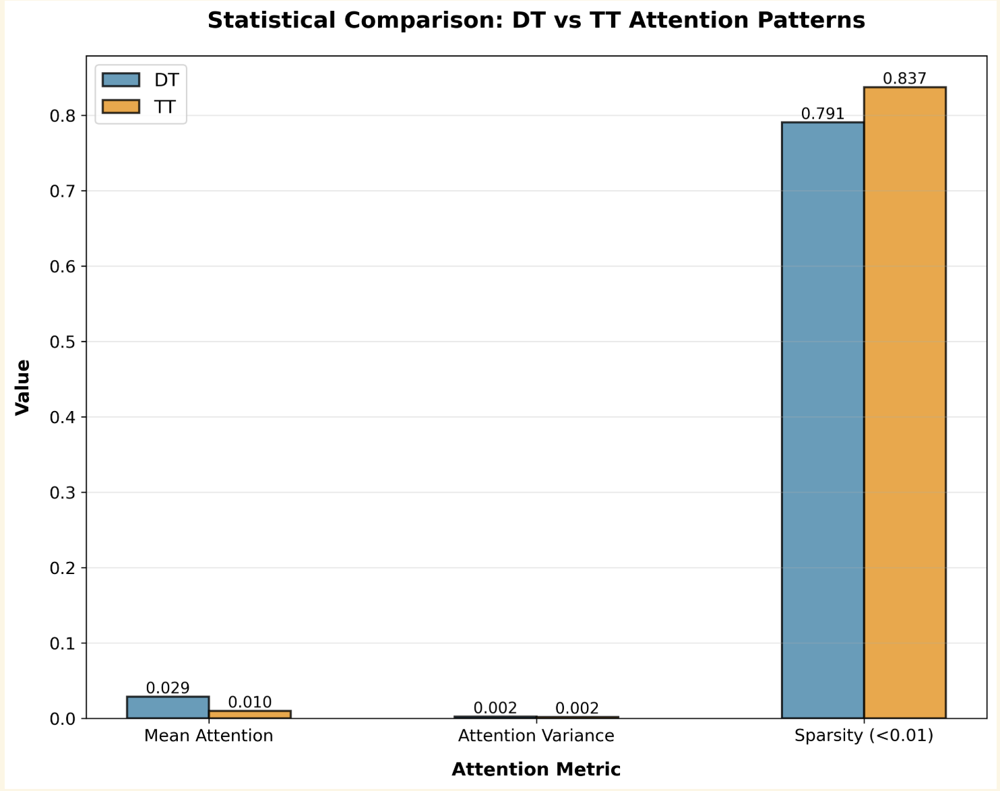
<figcaption>Quantitative comparison of attention sparsity, mean attention, and variance between DT and TT</figcaption>
</figure>

**Axes:** X-axis: three metric categories. Y-axis: metric values. Side-by-side bars compare DT (blue) and TT (orange).
  
Higher sparsity = more focused attention (fewer positions attended). Lower variance = more uniform distribution. These differences reflect architectural choices: DT's autoregressive RTG conditioning vs TT's joint trajectory modeling. Higher sparsity may improve interpretability but reduce robustness; lower variance captures global patterns but may miss critical details.

**Connection to Performance:** The sparsity analysis directly relates to the error propagation findings: TT's higher sparsity contributes to its lower error accumulation, explaining its superior performance on sparse-reward and long-horizon tasks.

#### Compute Cost Comparison: DT vs TT

<figure>
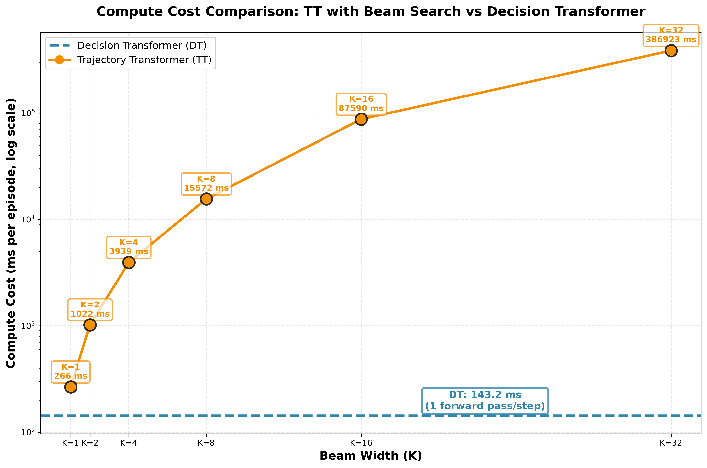
<figcaption>Empirical quantification of compute cost trade-off: DT maintains constant cost while TT scales linearly with beam width K</figcaption>
</figure>

**Axes:** X-axis: beam width K. Y-axis: compute cost in ms per episode (log scale). DT appears as a horizontal line (constant cost, one forward pass per step).

TT's cost scales linearly with beam width—doubling K doubles compute. Higher K enables better planning but increases cost. DT maintains constant low cost but lacks beam search flexibility. Choose DT for real-time speed, TT for long-horizon quality.

### Systematic Comparison: All Three Models

Based on our analysis, here's a systematic comparison of when each sequence modeling approach is most appropriate:

<table class="comparison-table">
<thead>
<tr>
<th>Aspect</th>
<th>Decision Transformer (DT)</th>
<th>Trajectory Transformer (TT)</th>
<th>Iterative Energy Minimization (IEM)</th>
</tr>
</thead>
<tbody>
<tr>
<td><strong>Architecture</strong></td>
<td>Causal GPT (autoregressive)</td>
<td>Causal GPT + Beam Search</td>
<td>BERT-like (bidirectional)</td>
</tr>
<tr>
<td><strong>Tokenization</strong></td>
<td>$[R̂, s, a, R̂, s, a, ...]$</td>
<td>$[s, a, r, s, a, r, ...]$</td>
<td>$[s, a, r, ...]$ (masked)</td>
</tr>
<tr>
<td><strong>Planning</strong></td>
<td>Greedy decoding</td>
<td>Beam search (K=1-32)</td>
<td>Iterative refinement</td>
</tr>
<tr>
<td><strong>Inference Speed</strong></td>
<td>Fast (single forward pass)</td>
<td>Moderate (K forward passes)</td>
<td>Slow (multiple iterations)</td>
</tr>
<tr>
<td><strong>Long-Horizon</strong></td>
<td>Struggles (error compounds)</td>
<td>Good (beam search helps)</td>
<td>Excellent (bidirectional)</td>
</tr>
<tr>
<td><strong>Sparse Rewards</strong></td>
<td>Moderate</td>
<td>Good</td>
<td>Excellent</td>
</tr>
<tr>
<td><strong>Compositional Tasks</strong></td>
<td>Poor</td>
<td>Moderate</td>
<td>Excellent</td>
</tr>
<tr>
<td><strong>Trajectory Stitching</strong></td>
<td>Fails</td>
<td>Fails</td>
<td>Fails</td>
</tr>
<tr>
<td><strong>Attention Pattern</strong></td>
<td>Broad, distributed</td>
<td>Focused, sparse</td>
<td>Global, bidirectional</td>
</tr>
<tr>
<td><strong>Error Propagation</strong></td>
<td>High (compounds)</td>
<td>Low (beam corrects)</td>
<td>Low (iterative refinement)</td>
</tr>
<tr>
<td><strong>Best For</strong></td>
<td>Simple, dense-reward tasks</td>
<td>Long-horizon, sparse rewards</td>
<td>Compositional, structured tasks</td>
</tr>
</tbody>
</table>

---

# 8. Limitations and Future Works

## 8.a Limitations

While sequence modeling represents a significant advance in offline RL, several important limitations remain:

- **Computational Cost:** Using transformers in RL is challenging for real-time deployment, as deploying these models in robots or real-time environments would make them prohibitively slow. A single forward pass through a Transformer requires $O(n^2)$ attention computation, where $n$ is the sequence length. For long trajectories, this becomes a bottleneck.
- **Trajectory Stitching:** Sequence models struggle with trajectory stitching: combining parts of different trajectories to reach goals not seen in training. This is evident in the AntMaze results, where sequence models (DT: 11.8) significantly underperform TD-learning methods (IQL: 63.2).
- **Distribution Shift:** Like all offline RL methods, sequence models face the distribution shift problem: the policy may choose actions that never appeared in the training dataset. While sequence models are more robust than some alternatives (they don't bootstrap from potentially incorrect value estimates), they still struggle when the test-time state distribution differs significantly from training.

## 8.b Future Works

The future of sequence-based RL lies in developing hybrid architectures that merge the reasoning depth of sequence models with the efficiency of traditional policies. By utilizing sequence models for high-level offline planning and lightweight feedforward policies for real-time execution, we can achieve deployment-ready latency without sacrificing robustness. Addressing current limitations requires integrating explicit trajectory stitching (via value functions) to enable novel path combinations in maze-like environments, alongside efficient Transformer variants (e.g., linear or sparse attention) to reduce computational overhead. Ultimately, the most capable agents will likely converge on a principled framework that combines the distributional stability of sequence modeling, the stitching capabilities of Q-learning, and the iterative refinement of energy-based methods like LEAP for composable, adaptive planning.

# 9. Conclusion

<blockquote>
Sequence modeling in RL represents more than a technical innovation—it's a fundamental reframing of decision-making. By treating trajectories as sequences and leveraging decades of progress in language modeling, we've opened new pathways for stable, scalable reinforcement learning. The attention patterns we've analyzed reveal how these models "think," providing interpretability that traditional RL methods often lack.

As the field continues to evolve, the integration of sequence modeling with traditional RL techniques promises to unlock new capabilities: real-time deployment, trajectory stitching, and compositional planning. The journey from "What's the value of this state?" to "What action comes next in this trajectory pattern?" is just beginning.
</blockquote>

# 10. References

Chen, L., et al. (2021). Decision Transformer: Reinforcement Learning via Sequence Modeling. NeurIPS.   

Janner, M., et al. (2021). Offline Reinforcement Learning as One Big Sequence Modeling Problem. NeurIPS.  

Chen, H., et al. (2023). Planning with Sequence Models through Iterative Energy Minimization. ICLR.  

Wikipedia Contributors. (n.d.). Reinforcement Learning. Wikipedia. https://en.wikipedia.org/wiki/Reinforcement_learning

Farama Foundation. (n.d.). MiniGrid Documentation. Farama Foundation. https://minigrid.farama.org/

Farama Foundation. (n.d.). Half Cheetah Environment. Gymnasium Documentation. https://gymnasium.farama.org/environments/mujoco/half_cheetah/

