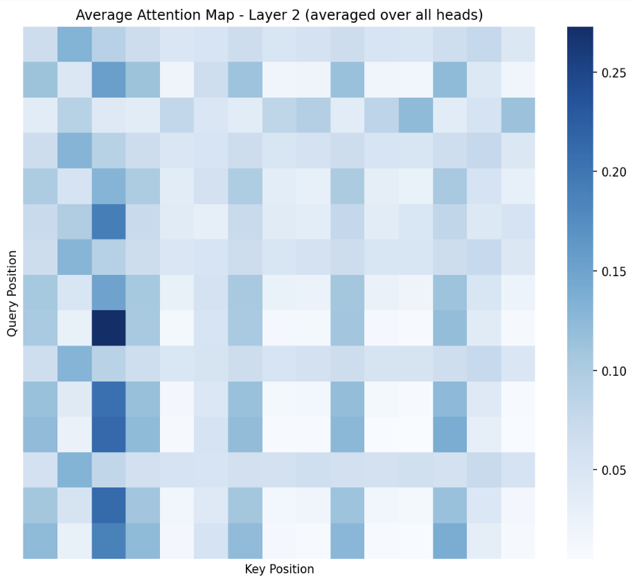

# Transformers, take the Wheel! 
## Sequence Modeling in Offline RL

Reinforcement Learning (RL) has traditionally relied on value estimation and Bellman updates, which are often unstable and difficult to tune. 

This project explores a paradigm shift: treating RL as a Sequence Modeling problem. We analyze and replicate three Transformer-based approaches—Decision Transformer (DT), Trajectory Transformer (TT), and Iterative Energy Minimization (IEM)—to understand how language modeling architectures can solve decision-making tasks.

Decision Transformer (DT): It establishes the baseline proof-of-concept models Reinforcement Learning as a Sequential modeling task.
Architecture used: causal GPT

Trajectory Transformer (TT): IT accepts the premise of DT (RL is Sequence Modeling) but critiques the "blind" generation. To actively plan into the future, it adapts the NLP concept of Beam Search. 
Architecture used: casual GPT

Iterative Energy Minimization (IEM): "The Refiner" – Uses a BERT-like masked model to iteratively "denoise" and optimize a full plan at once, minimizing a learned energy function.

## Inside the Black Box: Attention Analysis

  
  
  

DT: Vertical attention stripes confirm the model explicitly "checks" the desired future reward before committing to an action.
TT: Strong diagonal banding reveals it focuses on immediate past context over long term past.
IEM: Distributed grid-like attention states each position attends broadly across past AND future

Conclusion

The convergence of NLP and RL provides a unified framework where trajectories are treated as sentences, offering stability that traditional dynamic programming lacks. 
The future lies in hybrid architectures: combining sequence models' distributional robustness with Q-learning's trajectory stitching, and LEAP's iterative refinement for composable, adaptable planning.

References
Chen, L., et al. (2021). Decision Transformer: Reinforcement Learning via Sequence Modeling. NeurIPS.
Janner, M., et al. (2021). Offline Reinforcement Learning as One Big Sequence Modeling Problem. NeurIPS.
Chen, H., et al. (2023). Planning with Sequence Models through Iterative Energy Minimization. ICLR.

